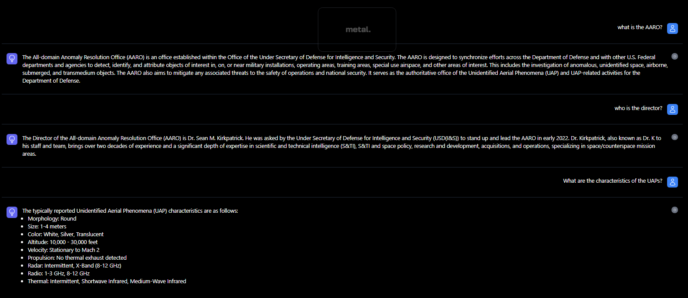

# Chat with the unclassified 'UFO' Reports 🛸

In this example, we are going to build a chatbot that can answer questions about the Unidentified Anomalous Phenomena (UAP),  formerly known as UFOs,  using the unclassified documents recently published by the [AARO.](https://www.aaro.mil/)



## **Prerequisites**

To follow along you will need:/

* /A Metal API Key and Client ID - find them [here](https://app.getmetal.io/settings/organization)
* Node.js v18+ (we recommend using [nvm](https://github.com/nvm-sh/nvm))
* An OpenAI Api key - get one [here](https://platform.openai.com/account/api-keys)

## Walkthrough

##### Step 1: Clone the Repository

```
git clone https://github.com/getmetal/Metal.git
cd Metal/examples/05-ufo-chatbot-nodejs
```

##### Step 2: Set up the Environment Variables in the Root Directory

Create a `.env` file in the root of the directory and include the keys provided by Metal.

```
METAL_API_KEY=pk_xx
METAL_CLIENT_ID=ci_xx
```

##### Step 3: Install dependencies

```
 npm i
```

##### Step 4: Review the 'reports' directory

Review the 'reports' directory which contains some of the PDF reports published as of now (09/27/2023). Feel free to include more files or data to feed your chatbot in this folder.

##### Step 5: Run the chatbot script

This code will create a Datasource with all the files as Data Entities. It will process the data, generate the embeddings and pushed them to a newly created Index.

```
node chatbot.js
```

##### Step 6: Set up the Environment Variables for the Chatbot Interface

Navigate to the chatbot directory with `cd chatbot `and install the necessary packages with `npm i` . After this, create a `.env.local` file and set the environment variables as shown below. You can find the Index ID in your [Metal Dashboard](app.getmetal.io)

```
METAL_API_KEY=pk_xx
METAL_CLIENT_ID=ci_xx
METAL_INDEX_ID=id_xx
OPENAI_API_KEY=sk_xx
```

##### Step 7: Deploy your chat

Run the chatbot

```
npm run dev
```

##### Step 8: Start Chatting👽

That's it! Go to `localhost:3000` and start chatting!
