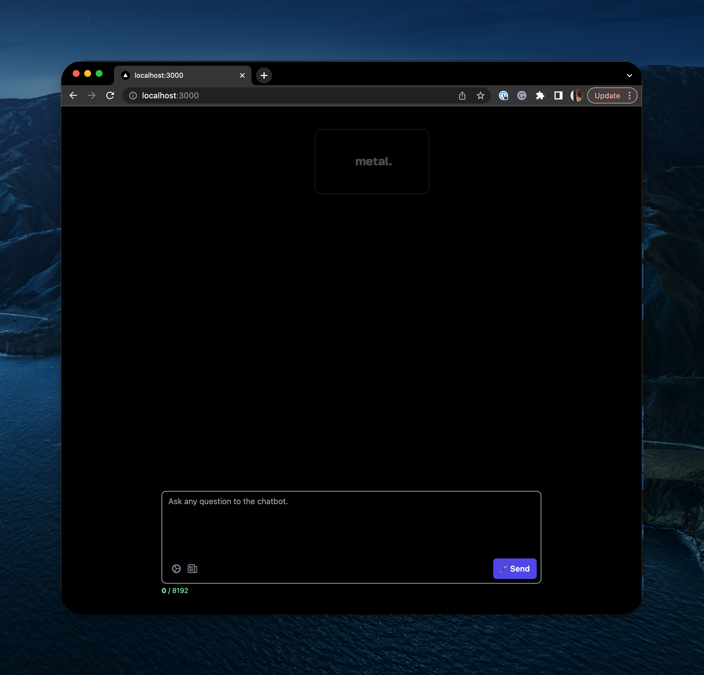

# 💬 Metal AI Chatbot
A simple Chat interface for building an AI powered chatbot experience to "talk with your data".

Built with [Next.js](https://nextjs.org/) and [Metal](https://getmetal.io).



## Getting Started

### 1. Install dependencies

```bash
npm i
```

### 2. Add environment variables

```bash
cp .env.example .env.local
```

Now, populate your environment variables for the project. You can find Metal related variables by visiting [Metal](https://getmetal.io).

### 3. Add your data

Navigate to the [Metal Dashboard](https://app.getmetal.io) and upload some files to your index.

### 4. Run the development server

```bash
npm run dev
```


### 5. 🧠 Ask a question!
Enjoy your new chatbot experience at [http://localhost:3000](http://localhost:3000).

## Password Protection
This chatbot supports password protection for your data. To enable this feature, simply add a `DEMO_PW` to your environment variables. The chatbot will automatically prompt the user for a password before allowing them to access the various endpoints.

## Deployment
For deployment, please refer to the Next.js [deployment documentation](https://nextjs.org/docs/deployment).
